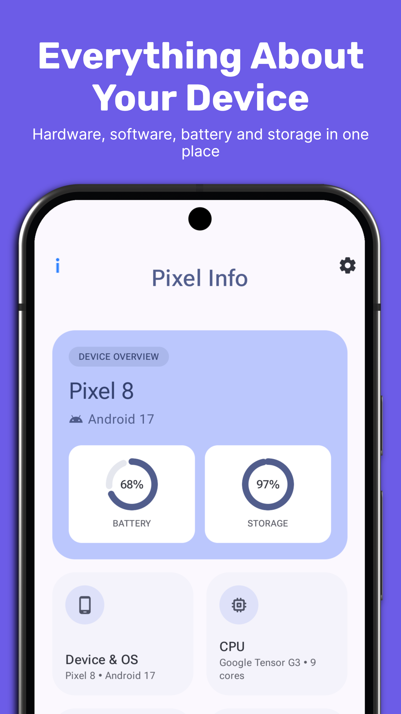
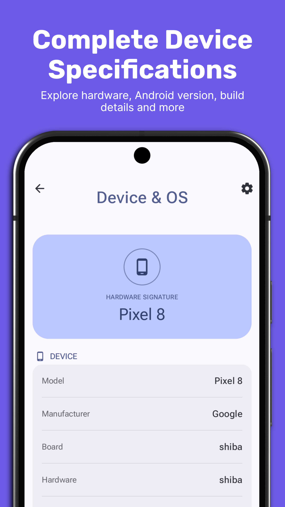
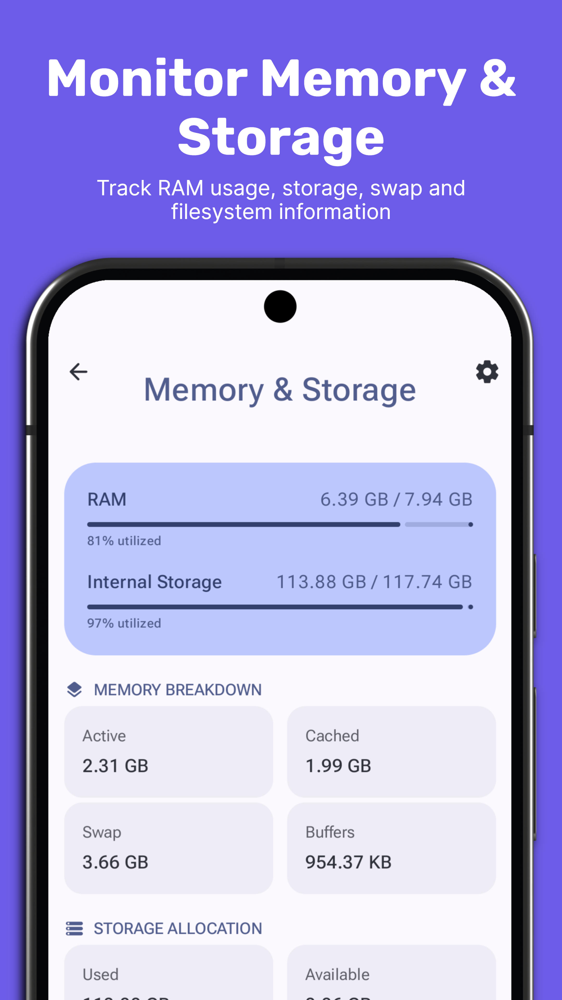
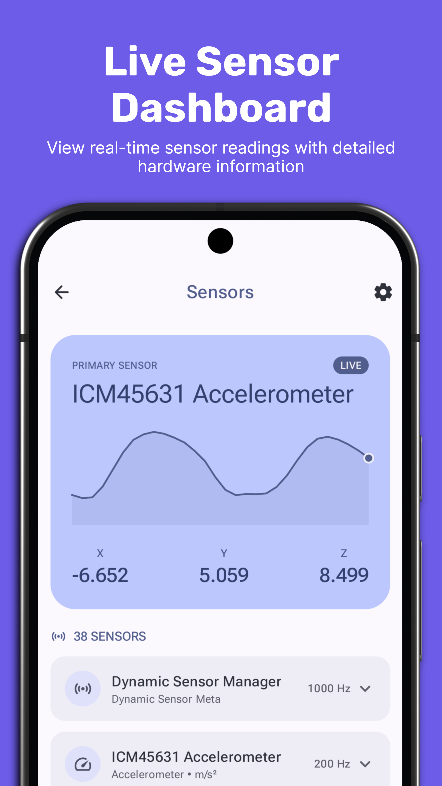
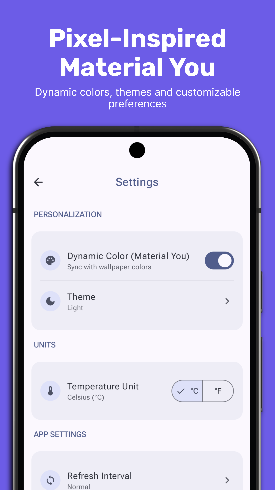

<p align="center">
  
</p>

<h1 align="center">Pixel Info</h1>

A modern device-information app for Android, visually aligned with first-party Google Pixel
apps (Material 3 Expressive). Everything it reads stays on your device — no accounts, no
network calls, no analytics.

## Screenshots

<div>
  
  
  
  <hr width=91%>
  
  
</div>

## Features

- **Dashboard** — a tabless entry point summarizing the device at a glance.
- **Detail pages** — Device & OS, CPU, Memory & Storage, Battery & Thermal, Display, Network,
  Sensors, and Camera, each with live-updating metrics and history charts.
- **Home screen widgets** — Battery, Storage, and Quick Stats, each independently themeable.
- **Material 3 Expressive design** — light/dark mode, dynamic color (Material You), rounded
  tonal surfaces, Roboto Flex typography.
- **Personalization** — Celsius/Fahrenheit toggle, configurable refresh interval, per-widget
  theme override.
- No accounts, no backend, no analytics or crash-reporting SDKs — network/location/Bluetooth
  permissions are requested contextually (only from the Network screen) and only used to
  display that data back to you.

## Prerequisites

- Android Studio (Narwhal or newer): https://developer.android.com/studio
- JDK 17+ (bundled with Android Studio)
- An Android device or emulator running API 24 (Android 7.0) or newer

## Build & run

```
git clone https://github.com/wwwescape/Pixel-Info.git
cd "Pixel Info"
```

Open the project in Android Studio and run the `app` configuration, or from the command line:

```
./gradlew installDebug
```

## Test

```
./gradlew lint testDebugUnitTest connectedDebugAndroidTest
```

`connectedDebugAndroidTest` needs a connected device or running emulator.

## Release a new version

```
git tag v0.1.0
git push origin v0.1.0
```

That tag push builds a signed release APK and AAB and attaches them to an auto-generated
GitHub Release. See `.github/workflows/release.yml`; it needs the `KEYSTORE_BASE64`,
`KEYSTORE_PASSWORD`, `KEY_ALIAS`, and `KEY_PASSWORD` repository secrets set (see
`keystore.properties`, which is gitignored and holds these locally).

## Project layout

```
app/       Kotlin, Jetpack Compose (Material 3), Glance (widgets), single module
design/    Source logo and Play Store icon assets
assets/    README/repo assets
```

## Privacy

Pixel Info collects nothing — see the in-app Privacy Policy (Settings → About) for the full
breakdown of what's read from the device and why.

## License

GPL-3.0 — see `LICENSE`.

## Support

If you find Pixel Info useful, consider buying me a coffee:

[](https://buymeacoffee.com/wwwescape)
